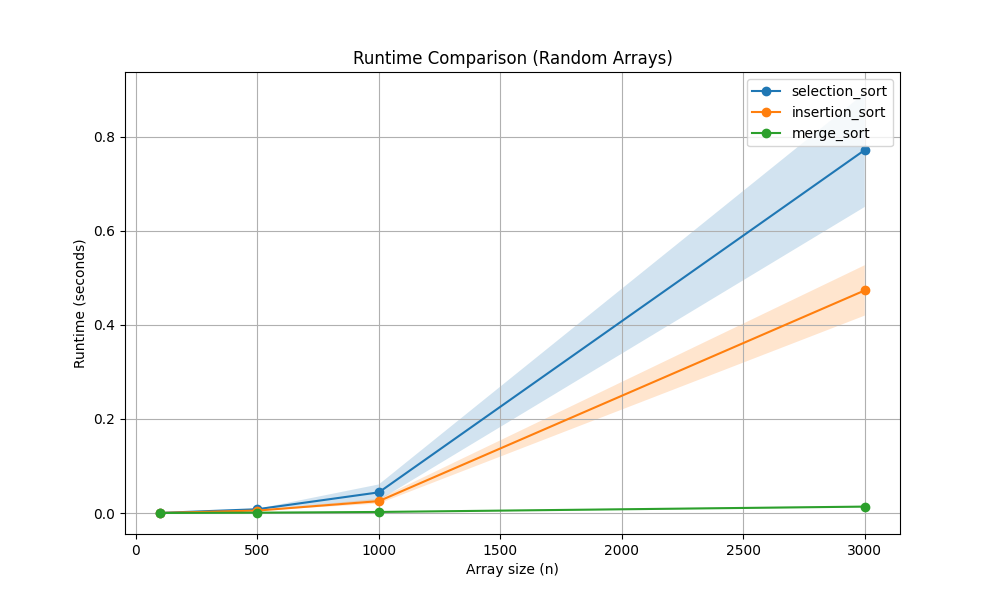
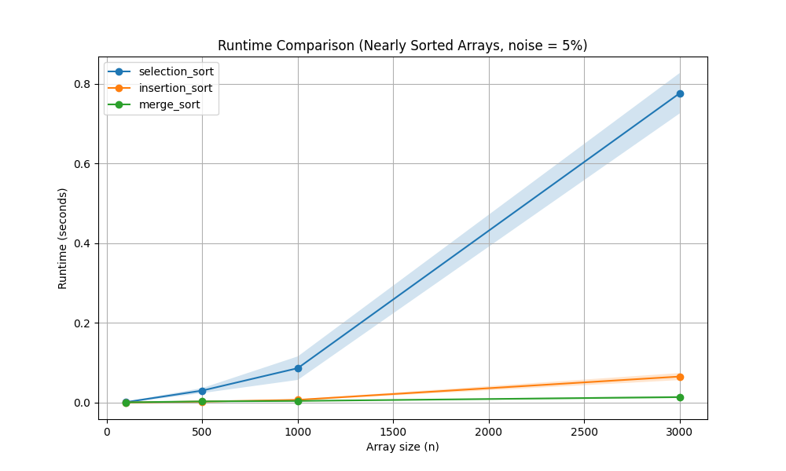

# -Sorting_Assignment-

## STUDENTS:
Yuval Sharabi (ID- 211491246) & Yuval Haim (ID- 318840014).

## Selected Algorithms
| ID | Algorithm       |
|----|-----------------|
| 1  | Bubble Sort     |
| 3  | Insertion Sort  |
| 4  | Merge Sort      |

### Command used to generate the figures 
```bash
 python run_experiments.py -a 2 3 4 -s 100 500 1000 3000 -e 1 -r 20
```
### Explanation

This command runs the experiments using three sorting algorithms on arrays of different sizes.  
Each test is repeated 20 times in order to get more stable average results.

- `-a` selects the algorithms.
- `-s` defines the array sizes.
- `-e` chooses the experiment type \ noise level.  
- `-r` controls how many times each test is repeated.

## Results

### Part B- Random Arrays



### Explanation

From the graph, it can be seen that Merge Sort is significantly faster than the other algorithms as the input size grows.

Selection Sort and Insertion Sort both show a steep increase in runtime, which matches their quadratic time complexity (O(n²)). As the array size increases, the number of operations grows rapidly, leading to much longer running times.

Merge Sort, on the other hand, grows much more slowly. This is because its time complexity is O(n log n), which scales better for larger inputs. This difference becomes more noticeable as the array size increases.

### Part C- Nearly Sorted Arrays (5% noise)



### Explanation

In this case, when the arrays are nearly sorted, Insertion Sort performs noticeably better compared to the random case.

This happens because Insertion Sort has a best-case time complexity of O(n) when the array is already sorted or close to it, so it requires fewer shifts.

Selection Sort does not show much improvement, since it always performs the same number of comparisons regardless of the input order, which keeps its time complexity at O(n²).

Merge Sort remains fast and consistent, as its time complexity is always O(n log n), and it is not affected by how sorted the input is.

#### The comparison between the graphs shows that input structure has a strong impact on Insertion Sort, which improves significantly for nearly sorted arrays.  In contrast, Merge Sort is stable regardless of the input, and Selection Sort behaves similarly in both cases.
 
